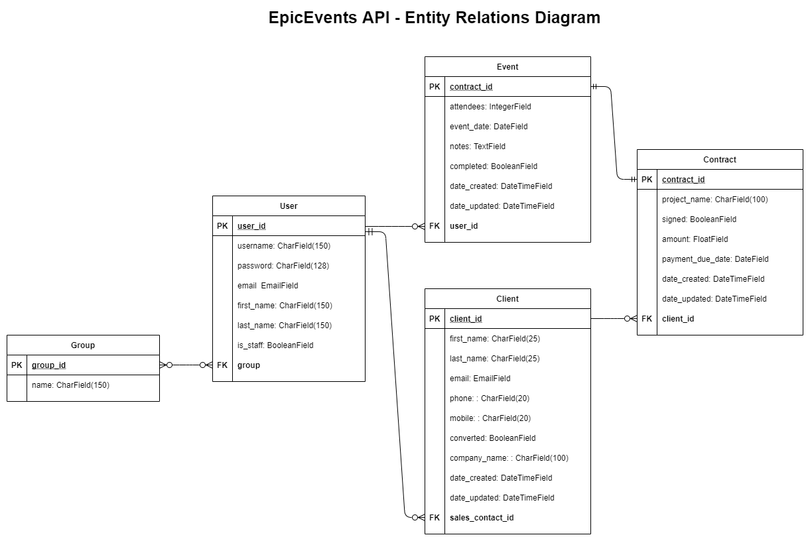

# EPICEVENTS

Openclassrooms - Parcours développement Python Projet 11

## Status

This project is ready for evaluation.

## Description

EpicEvents is an API is organized around  [REST](https://fr.wikipedia.org/wiki/Representational_state_transfer). This API has predictable resource-oriented URLs, accepts form-encoded request bodies, returns JSON-encoded responses, and uses standard HTTP response codes, authentication, and verbs.

The **documentation of the API** is available at the following [location](https://documenter.getpostman.com/view/14947762/TzJu9x5r).

This project uses the following technologies:

* [Python](https://www.python.org) as the programming language
* [Django](https://www.djangoproject.com/) as a web framework
* [Django REST Framework](https://www.django-rest-framework.org/) as a REST API framework
* [Pytest](https://pytest.org) and [Coverage](https://pypi.org/project/coverage/) for testing
* [Postgresql](https://www.postgresql.org/) as a database

## Database

The API allows interfacing with a database that contains the following tables:

* `User`: contains information about the API Users
* `Group`: contains information about the groups of users used to definme permissions for accessing the data from the different tables.
* `Client`: Contains data related to the clients of Epic Events.
* `Contracts`: Contains data related to the contracts signed by the clients of Epic Events.
* `Events`: Contains data related to the events organised by Epic Events after a contract is signed.

The Entity Relations Diagram is the following, also available at the following [location](https://viewer.diagrams.net/?highlight=0000ff&edit=_blank&layers=1&nav=1&title=ERD.drawio#R7Z1bc6M4Fsc%2Fjat2H5LiYhz7MfGlp3e7a1Od3t3ZeUmpjWLTA4gFObH7048EAmwLOxAMEjJVmWkjsMD6H%2F10O0cMzKm3%2FRSCYP0V2dAdGJq9HZizgWHoY2tI%2FqEpuyRlMjSThFXo2OyiPOHJ%2BQVZosZSN44No4MLMUIudoLDxCXyfbjEB2kgDNHb4WUvyD28awBWkEt4WgKXT%2F2vY%2BN1kjq2tDz9N%2Bis1umddY2d8UB6MUuI1sBGbwdJcIsXyMfsER9h6AEf%2Bpic%2BQrCP2E4sOZrjOkvvR8YC%2FL3Qq%2B%2BXSG0ciEInOh2iTySvIzIJYsX4DkuLea9jB5YRuR25nxgTkOEcPLJ206hS7VKZUieaXHibFYOIc23xBfM2VwP3ubz2Wf%2Fd7j5w37Sf%2FznhuXyCtwNK99%2FR8nTkfLBu7TQSVEF9CMGP2jSQ4RBiJltmBpJIGpj4Pjkq%2BZMj49dFwSRE1%2BepKwd1%2F4CdmiD04zSo4cXZwvtb4lp0GuJlXwhmdFDmjkt5Cf2MPQ0cJ2VTz4vyS%2Bnd3wIYUSe5QuIMLuCL5v0h8IQw%2B1eEiurTxB5EIc7cgk7e2OmFs8qSnb8lpudYbK09Z7JGWOWCJgdrbLMc3nIB6ZQBbUMTq2TSpHfjh3gfiNVEPirWLRDTWjB2iEKvoNwBTFLCJBDi3T%2BCpNKEJe%2B47pT5CIqrY98mhNGATvpwpf0uz8QxsT4mYKsOLJM46KwHsgfKZypdmsNLPK4U3Ks58fkj14e4inyIxwSg6J5QKLrG6TaFuh61qrfFzvVtqS0ZlPKmpyyj%2F%2Bspm1MW5BrW1k27Ui241qHSHG%2BuDEw145tQ7%2B8HkZpPfYEaLX8h1z5bwgHn8l3xIqQoi659iEKwNLxV1%2BSb46OVLLaUml7utZobapmdYKHx5p2gIcj0Twc1VT24hUR2k6aX00YWqXFEAXDu0IY%2BsCDcb9Xm65BuHCga%2F9Nt7S%2Fy07IVqSShYjjnojNEHEimogTdYk4Li2GKCKmQ7%2B90g9AFL2h0OaQaIxVRmJ5rWRBos7PcfRMvAgTdUM0FPW6MyISU1Evr4cwLPLTFtADjjuYGoN7clNtTo9iLiqMxApCycJEg%2B%2Fi90y8DBMt0Uw06o4BJGZiZrfyMtHgO%2BovThjh5yscP1eQSxYymnxPvyfjZcg4Fk1Gs%2B5IQGIyZnYrLxlNvrPugj0wxp3Gq2FjBcEEsPEfv34ZIwwXN6b1%2F8%2Bzn1v8%2BrgscBbo0XgRNBplXQsak1aNcfRZq5UCjIVPyI%2Bineg5wuDlJekvPiDkQuArNI6uKZQsQOS9BnogXgaIQ9FA5F0LFqIdckog8dBnp1y1G5YWRxQfeWeAVYg2QRdR2KxA0gyi%2BRZt6jqx%2F%2BsJya7IsfTIrXRYNGFoFal115hc3WjHxPuVZnZdy7G0UNzGtOUbMpU8S02pWq%2FiR%2BSbr2UMw%2BvyLq2g1JlmzGhVuX6VrCkuFjmYtstFhVfJTPlXycwqq2SGpfRE8EUWyVoFYzo678F4cTAW%2BZm2Csahwotkmd3KC8YhPxN%2FsEh2PVysIJYsXBzXddLuuXiKi4W%2Bpq2CcVK30ZMYjJnhygvGCd8uJb6mMRSvwtG0gkqyEHHCN2c9ES9ExNITx42Jy0%2FzK0PEzHAlJiI%2FbR%2Bs41KjROQ6i0p7U1WQSxo09tHrjaGxyNW0XTQqHMA%2BkT%2BCfcLP3Hvoh%2BNeJxsvEsbeLhv7OPam2Fjoa9ouGxUOZZ90IZadn8ggZRo%2Fsa2qw2ldsWQBo671TviNkbHI6bRVMupa3ekSidGYm67MbOSnNJbIC4C%2F21uB4aI4NaX7j1WEk4eT3fBp7CQn78Rzsu7cidSclN%2BnUdf4%2BQ0bYPi8DCHIupEz8vG740HV%2B5FVFJMHkL1zY1OANDXxgFTYvTE3XZkByU9yxIDcBPY1ArKDPo51Fzd7Pp7ko%2FComCE%2FOlAgvPO8HcsLyyHfm4%2BAC6PnOPhv2YVAGQFqSQNKfihAiEKAsuzDPfdhV3WWsbnXiAy70fUXH%2B%2BZmXZ34j2HfMdfpXjPofxd%2FyHf818yHnagIbtgxGcFrWRpy6y%2B098UGYVHfFp1VwQknhKx5O%2FkW3wnPwjRT1KkxTujqr2mVkEwAWws3qWsD25qio1tBn0WbzGkRmzTebuVgo3Fxc879USEPeq6Y9UVSpb%2Bol6wvU4PxctAUXzEp16wdU8XsfiO6UrBxRPPyM9UAQ9t6A%2BjYFy4CGCFsFhbKFm4aPV9xcawKDzsc6RGZ%2FG84coLxRHfWQzAzqMbytkb%2BEzdC3LvAtXhWEEvWdioF7xMsIfjheAoPPBTr%2F26QYnpmJuuvHjUC94JeMWuqRUUkweQ%2FSpMU4AUH%2F2p6wqvw%2BSmKzMg%2BTmrK3ZNraCYLIC06k5L9Xw8yUfhMaAWP%2BWlqmuqVV4eYavWvDtVZzZvFyCTLIQc8WOAmGUnJbsih9Sj94%2FoZYOVmvNHHXWjvy%2FeHzUz6%2B74o4743r5K%2Fqgj%2Bfv7I767f53%2BqBW0kqYd63v6TZFRuD%2FqqG4UhsTzICP5e%2FYjvmcPMIa%2BDWn3jE6BfCYVYwVD1WdAKmglDRZ794KmsCj8%2FSPp5jJKYlF%2B74K7gm32X2PfgqvyK6iglCxQ1PWeik1RUQJfVENhLuamKy8YdYMno49w2ln8Drfqe6JWkEkaKpr8VHBPxQtRUbgrql7wpnF1qGiWV0Schz4%2Fv0s3THXhtW0mXUUtaeBo9HBsDI7iXVENleFodACOBg%2FHK3ZFraCYPIDs4zubAqQErqiGyvGdRgfiOw1%2BDeyKXVErKCYLIMf9AnVjfBTuijq%2BHlfUsfwL1mN%2BwXoTwbADPjwCRJKFj7pRYiN2aK9gWhakBBy8%2BwZdgB3kz%2FMzSYklnqk6%2BckPa%2By5rBZA374Pw7iA599%2BwRB9R1%2BBvxswf9b8nAd8%2B1%2BxxOQ%2B4e73tFLRg%2F%2FRg1srPZxt90%2FOduzo58YL2FOMkjuzo%2FHg0Hs2O144tMiSrLYOpvfUbzXNYMfJbcfsKL8rPdjtHTzCkPQBYrdY9lg2y%2FmsX2yENuESnlGIyYHTNufUdenOvFSssnzIfGv3bS1LDGORX%2BHB8xZZILvHI220ctu%2BuWN4Tl09U1fLNIvkp7Nv5XbMZ5Q2NCyj4bGjb1I2XEZxhch%2BeJ06UmLhsq06wgiYWeqBlVrnrVRElfq44aczt%2B9afur%2FL43lH7uwG9qRwZa1%2FOxFHSwj6zijpi0%2FbXfas%2Fy8BXi%2FadCr2XFaZ7QKdebj5pvuLvuu%2BY5kA%2Ffw7sh8jQ%2Bar3GUkTlp23xL7HXQg7siuKWx05vxkXmlDUFVO9XfyedyZlq4r2DBfiufQrQJOFO9wmCwm5Fx1AQWeToVjXP147byYrth1t5BRcFwsPOGXSscrNWdTgs2Z%2BloONh505ViGqn4EflF4RWlYQfmkT4WC1ZXqDNTSUWtb3PC9W%2B0bQqLRbFg7VZKNd5ne95uJWYiv4pV%2BE4CS5V3EtQVShYmmlLNrh%2BcOz8a%2FNgwdX%2FGe388WXoG%2FGxbKM%2FA0zyakbbSGPbKU9um%2Fk5ODY89h3x%2Fdx44S9bEGtr942fy%2Fxvy3zw2TfIhtU56euaAVQg8zqZJ%2FcSHRkoaTPQnPGJLAW64USWt7c4SuPfshEeoEdeIt7WD4RMBDL3nWwiCeMi68W3ql5F3nBObNiyuI32BwWkWjXh6%2BDIqaiiOJ9RK8IYchgjhffXJT15%2FRTakV%2FwF):



## Installation

**Python 3** and **postgresql** are required to run the API.

1. Clone this repository (or download the code [as a zip file](https://github.com/antoine71/epicevents/archive/main.zip)), navigate to the root folder of the repository, create and activate a virtual environment, install project dependencies:

```shell
git clone https://github.com/antoine71/epicevents.git
cd epicevents
python -m venv env
source env/bin/activate
pip install -r requirements.txt
```

2. Create a postgresql database and start the postgresql server.

```shell
createdb epicevents_db
sudo service postgresql start
```

3. Modify as required to suit the requirements of your system the settings to connect to the database from the file `config/settings.py`

```python
...
DATABASES = {
    'default': {
        ...
        'USER': 'postgres',
        'PASSWORD': 'admin',
        'HOST': 'localhost',
        'PORT': '5432',
    }
}
...
```

4. Apply the migrations to the database and create a superuser

```shell
python manage.py migrate
python manage.py createsuperuser
```

5. Run the server

```shell
$ python manage.py runserver
```

## Usage

The api can be queried from the following address:

```
http://localhost:8000/api/
```

The following endpoints are available:

```
api/auth-token/ # POST
api/clients/	# GET, POST
api/clients/me	# GET
api/clients/prospects	# GET
api/clients/{pk}/	# GET, PUT, PATCH, DELETE
api/clients/{pk}/contracts/	# GET, POST
api/contracts/	# GET
api/contracts/me	# GET
api/contracts/{pk}/	# GET, PUT, PATCH, DELETE
api/contracts/{pk}/events/	# GET, POST
api/events/	# GET
api/events/me	# GET
api/events/{pk}/	# GET, PUT, PATCH, DELETE
```

All the API endpoint details are provided in the [API documentation](https://documenter.getpostman.com/view/14947762/TzJu9x5r).

## Administration

The application comes with an administration site.

```
http://localhost:8000/api-admin/
```

Only users with the status `superuser` or users that belong to the group `managers` can log in to the admin site.
The functionnalities for users that belong to the group `managers` are limited to only what is strictly required by the users of the management group.

* `superuser` have read/write access to the following tables: `Tokens`, `Groups`, `Clients`, `Contracts`, `Events`, `Users`
* `managers` group users have read/write access to the following tables: `Clients`, `Contracts`, `Events`, `Users`. The access to the table `Users` has the following limitations:
  * can not see or create users with `superuser` status
  * can not see or create `Users` permissions

## Users Management

The managers can login to the api administration site to create new users. Users can be assigned to any of the 3 following groups:

* `sales`: for users members of the sales group.
* `support`: for users members of the support group.

The members of the sales and support group benefit from permissions to access the API. The permission system is described in the API documentation.

* `managers`: for users members of the managers group.

The managers can log-in to the api admin site. From this site, they have full access to the Client, Event and Contract database tables. They have partial access to the User table. They can not see or create superusers. They can create new normal users, modify or delete existing normal users.

## Logging

The application will perform the following logging:

* `django-errors.log`: logging of error messages of the following levels:
    * WARNING: Information describing a minor problem that has occurred.
    * ERROR: Information describing a major problem that has occurred.
    * CRITICAL: Information describing a critical problem that has occurred.

example:
```
[26/Apr/2021 20:36:04,868] Internal Server Error: /api/contracts/1/events
Traceback (most recent call last):
  File "/home/antoine/.virtualenvs/epicevents/lib/python3.8/site-packages/django/core/handlers/exception.py", line 47, in inner
    response = get_response(request)
  File "/home/antoine/.virtualenvs/epicevents/lib/python3.8/site-packages/django/utils/deprecation.py", line 116, in __call__
    response = self.process_request(request)
  File "/home/antoine/.virtualenvs/epicevents/lib/python3.8/site-packages/django/middleware/common.py", line 54, in process_request
    path = self.get_full_path_with_slash(request)
  File "/home/antoine/.virtualenvs/epicevents/lib/python3.8/site-packages/django/middleware/common.py", line 88, in get_full_path_with_slash
    raise RuntimeError(
RuntimeError: You called this URL via POST, but the URL doesn't end in a slash and you have APPEND_SLASH set. Django can't redirect to the slash URL while maintaining POST data. Change your form to point to localhost:8000/api/contracts/1/events/ (note the trailing slash), or set APPEND_SLASH=False in your Django settings.
```

## Testing

* The repo is provided with a test suite in the folders `epicevents/events/tests/` and `epicevents/users/tests/`. The tests can be run using the following command from the root folder of the project:

```shell
pytest
```

* A full test report can be generated in html format thanks to the utility Coverage. Coverage will create a new folder named `htmlcov`. Open the file `htmlcov/index.html`to view the report. To generate the report, from the root folder of the project, run the following commands:

```shell
coverage run -m pytest
coverage html
```
